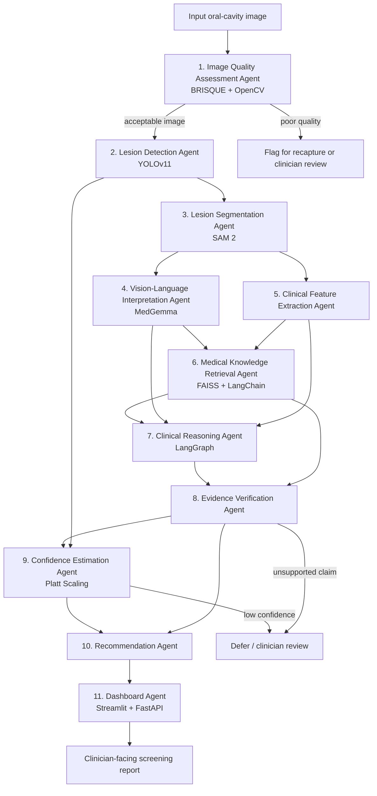

# Methodology

## 1. Overview

This methodology describes the proposed research workflow for **An Agentic Vision-Language Framework for Explainable Oral Cancer Screening using Evidence Verification and Confidence-Aware Clinical Reasoning**. The framework is designed as a clinical decision-support research prototype: it assists review of oral-cavity images but does not provide autonomous diagnosis, replace clinical examination, or replace biopsy, pathology, or specialist judgement.

The workflow separates image analysis, knowledge grounding, reasoning, verification, confidence estimation, and presentation into eleven specialised agents. This separation makes each stage inspectable and allows uncertain, poor-quality, or weakly supported cases to be flagged for clinician review.

> **Implementation status.** The repository currently contains the agent interfaces and pipeline initialisation. The technologies described below are the selected implementation approaches and evaluation plan; model integration and clinical validation remain future work.

## 2. Methodological design

The methodology follows a sequential but traceable information flow. The first five stages transform an oral image into localised and structured visual findings. The next four stages retrieve evidence, form a reasoning artefact, verify claims, and calibrate confidence. The final two stages create and present a clinician-facing screening report.

## 3. Module summary

| Module | Technology | Input | Output |
|---|---|---|---|
| Image acquisition | Standardised oral-cavity image capture | Oral image and permitted metadata | Candidate image for quality assessment |
| Image quality assessment | BRISQUE + OpenCV | Candidate image | Quality score, quality flags, accept/review decision |
| Lesion detection | YOLOv11 | Quality-approved image | Candidate lesion bounding boxes and detection scores |
| Lesion segmentation | SAM 2 | Image and candidate lesion region | Lesion mask and spatial measurements |
| Vision-language interpretation | MedGemma | Image, lesion region/mask, structured prompt | Structured visual observations |
| Clinical feature extraction | Rule-based analysis | Detection, mask, and visual observations | Structured lesion-feature record |
| Medical knowledge retrieval | FAISS + LangChain | Feature record and clinical query | Relevant, attributable evidence passages |
| Clinical reasoning | LangGraph | Visual findings, features, retrieved evidence | Structured screening reasoning artefact |
| Evidence verification | Claim-to-evidence alignment | Reasoning claims and retrieved evidence | Supported, unsupported, or contradictory claim status |
| Confidence calibration | Platt scaling | Held-out-calibrated model scores and verification status | Calibrated confidence and defer/review signal |
| Recommendation generation | Rule-based templates | Verified claims, confidence, and quality status | Evidence-linked screening recommendation |
| Dashboard presentation | Streamlit + FastAPI | Complete structured report | Clinician-facing interactive presentation |

## 4. Detailed workflow stages

### 4.1 Image Acquisition

**Objective:** Obtain an oral-cavity image of sufficient clinical and technical quality for downstream screening support.

**Input:** A captured oral image and only the metadata permitted by the approved data-governance protocol.

**Processing:** Images are collected from an appropriately licensed source or approved capture workflow. File format, image identity, label availability, and permission status are checked. Dataset preparation will use documented inclusion/exclusion criteria and patient-level train, validation, and test splits to prevent leakage.

**Output:** A traceable candidate image passed to the quality-assessment agent.

**Technologies used:** Image-file handling and dataset documentation; the repository will use Python-based processing utilities.

**Expected benefits:** Establishes reproducibility, privacy-aware handling, and a clear provenance record before AI processing begins.

### 4.2 Image Quality Assessment Agent

**Objective:** Prevent unsuitable images from producing misleading downstream results.

**Input:** Candidate oral image.

**Processing:** OpenCV-based checks assess properties such as blur, brightness, contrast, and framing. BRISQUE supplies a no-reference image-quality score. The combined result is compared with predefined, validation-derived thresholds; an unsuitable image is flagged for recapture or clinician review rather than silently progressing.

**Output:** Quality score, individual quality flags, and an accept/review decision.

**Technologies used:** BRISQUE and OpenCV.

**Expected benefits:** Reduces avoidable errors caused by poor focus, exposure, or field of view and makes image-quality limitations visible in the final report.

### 4.3 Lesion Detection Agent

**Objective:** Localise image regions that may contain suspicious oral lesions.

**Input:** Quality-approved oral image.

**Processing:** YOLOv11 is planned for training or fine-tuning on appropriately annotated oral-image data. The detector produces candidate boxes and confidence scores. Post-processing will apply validated score thresholds and remove duplicate detections; cases with no reliable candidate are recorded explicitly.

**Output:** Candidate lesion bounding box(es), detection score(s), and no-detection status where applicable.

**Technologies used:** YOLOv11, PyTorch, and image-processing utilities.

**Expected benefits:** Focuses subsequent segmentation and interpretation on a relevant region while retaining the original image context.

### 4.4 Lesion Segmentation Agent

**Objective:** Estimate the pixel-level extent of each detected lesion.

**Input:** Quality-approved image and lesion bounding box(es).

**Processing:** SAM 2 is prompted or conditioned with the detected region to generate a candidate mask. Mask refinement and validity checks will be evaluated against expert annotations where available. The mask supports measurement of area, border, colour distribution, and other image-derived descriptors; it is not itself a diagnostic conclusion.

**Output:** Lesion mask(s), mask quality indicators, and mask-derived spatial measurements.

**Technologies used:** SAM 2 and OpenCV.

**Expected benefits:** Provides explicit lesion localisation and quantitative inputs for feature extraction and explanation.

### 4.5 Vision-Language Interpretation Agent

**Objective:** Transform visual evidence into structured, clinically understandable observations.

**Input:** Original image, lesion region/mask, and a constrained prompt containing permitted context.

**Processing:** MedGemma is planned to analyse image context and lesion-focused content. Instead of relying on unconstrained prose, the agent should return a schema that distinguishes direct observations (for example, visible location, colour variation, or surface appearance) from model inferences. It must avoid definitive diagnostic language and retain references to the corresponding image artefacts.

**Output:** Structured multimodal observation record and any uncertainty or limitation flags.

**Technologies used:** MedGemma and structured prompting/output parsing.

**Expected benefits:** Connects visual analysis with human-readable observations while preserving a machine-auditable format for later verification.

### 4.6 Clinical Feature Extraction Agent

**Objective:** Convert visual outputs into consistent clinical-feature descriptors for reasoning and retrieval.

**Input:** Detection boxes, segmentation mask(s), image-quality status, and VLM observations.

**Processing:** A rule-based feature layer will derive features such as lesion location, approximate area, shape, border characteristics, colour-related descriptors, and quality limitations when those measures have been validated. Features are kept separate from diagnostic labels and include source provenance (detector, segmenter, VLM, or calculation).

**Output:** Structured feature record with feature values, sources, and availability/quality flags.

**Technologies used:** Rule-based analysis, OpenCV/NumPy, and structured Python data models.

**Expected benefits:** Gives later agents stable, interpretable inputs instead of opaque image embeddings alone.

### 4.7 Medical Knowledge Retrieval Agent

**Objective:** Retrieve relevant, approved medical knowledge that can support or challenge screening claims.

**Input:** Structured feature record, VLM observations, and a generated clinical query.

**Processing:** Permitted literature, guidelines, or other curated sources are chunked with bibliographic metadata, embedded, and indexed in FAISS. LangChain coordinates query construction and retrieval. The agent returns passages with source identifiers, relevance scores, and retrieval metadata; retrieval is not assumed to make a claim true.

**Output:** Ranked evidence passages and citations/metadata for use by reasoning and verification.

**Technologies used:** FAISS, LangChain, sentence-transformer or other approved embeddings, and a curated knowledge corpus.

**Expected benefits:** Grounds subsequent language generation in traceable sources and reduces reliance on model memory alone.

### 4.8 Clinical Reasoning Agent

**Objective:** Combine visual findings, structured features, and retrieved evidence into a transparent screening rationale.

**Input:** Quality result, detection and segmentation outputs, VLM observations, clinical-feature record, and retrieved evidence.

**Processing:** LangGraph orchestrates the stateful hand-off between agents and records dependencies between artefacts. The reasoning stage produces explicit claims, associated observations, and evidence references. It should distinguish observations, evidence-supported inferences, missing information, and requests for clinician review.

**Output:** Structured reasoning artefact containing claims, rationale, evidence links, limitations, and trace identifiers.

**Technologies used:** LangGraph and structured agent state.

**Expected benefits:** Makes reasoning reviewable at claim level instead of presenting an untraceable end-to-end answer.

### 4.9 Evidence Verification Agent

**Objective:** Check whether generated claims are adequately supported by retrieved evidence before they are shown as part of a recommendation.

**Input:** Claim-level reasoning artefact and the retrieved evidence passages.

**Processing:** The verifier assesses relevance, entailment/support, source quality, and contradiction for each claim. A claim is labelled supported, insufficiently supported, contradictory, or unverifiable. Unsupported claims are removed, rewritten as uncertainty, or routed for review; the verifier does not invent missing evidence.

**Output:** Verified claim set, claim-to-source links, and evidence-status flags.

**Technologies used:** Retrieval cross-validation, claim-to-evidence matching rules, and structured verification records.

**Expected benefits:** Reduces plausible-but-ungrounded medical explanations and creates an auditable evidence trail.

### 4.10 Confidence Estimation Agent

**Objective:** Communicate how reliable the relevant predictive score is and identify cases that should be deferred.

**Input:** Raw model score(s), held-out validation labels used for calibration, image-quality status, and verification status.

**Processing:** Platt scaling maps eligible raw scores to calibrated probabilities using validation data independent of final testing. Calibration performance is measured before thresholds are fixed. Low-calibration reliability, poor image quality, unsupported claims, or a score below the approved threshold trigger a defer/review signal rather than an overconfident recommendation.

**Output:** Calibrated confidence, calibration/quality flags, and accept-versus-defer status.

**Technologies used:** Platt scaling and scikit-learn.

**Expected benefits:** Avoids equating raw model confidence with reliability and supports safer risk communication.

### 4.11 Recommendation Generation Agent

**Objective:** Produce a concise screening-support recommendation from verified and confidence-aware information.

**Input:** Quality decision, verified claims, evidence links, calibrated confidence, and defer/review status.

**Processing:** Rule-based templates assemble a report that separates observed findings from supported interpretation. The report includes quality status, localisation, key features, supporting citations, confidence, limitations, and an appropriate next step. When evidence is weak or confidence is low, the template prioritises clinician review or recapture rather than diagnostic language.

**Output:** Structured clinician-facing screening recommendation.

**Technologies used:** Rule-based templates and structured report generation.

**Expected benefits:** Produces consistent, cautious, and reviewable communication for clinical users.

### 4.12 Dashboard Presentation Agent

**Objective:** Present the complete workflow output in an accessible interface for review.

**Input:** Structured recommendation report and all approved supporting artefacts.

**Processing:** FastAPI is planned to expose validated backend results, while Streamlit presents the image, lesion overlays, quality status, observations, evidence links, verification outcome, calibrated confidence, and recommendation. The presentation layer should make uncertainty and limitations prominent and must not conceal failed or deferred stages.

**Output:** Interactive clinician-facing dashboard and, where approved, exportable report.

**Technologies used:** Streamlit and FastAPI.

**Expected benefits:** Enables rapid review of both the conclusion and the evidence trail that led to it.

## 5. Information flow and interaction among the eleven agents

The image-quality agent is a gatekeeper: it either passes a suitable image to detection or raises a review/recapture flag. Detection sends lesion candidates to segmentation. Segmentation, together with the original image, informs both the VLM agent and the clinical-feature agent. The VLM produces structured observations, while feature extraction produces quantitative and rule-derived descriptors.

The retrieval agent uses these structured findings to formulate a knowledge query and returns attributable evidence. LangGraph coordinates the reasoning agent’s access to the visual, feature, and retrieval artefacts. The reasoning agent never directly finalises a recommendation: its claims are first checked by the evidence-verification agent. Confidence calibration receives relevant predictive scores and stage-quality signals, then independently provides a confidence/defer decision. The recommendation agent combines only verified claims with the calibrated-confidence and quality status. Finally, the dashboard agent presents the report and its provenance for human review.

Each agent should exchange versioned, structured records rather than unstructured text alone. Every downstream artefact should retain identifiers for its source image, region, evidence passage, and upstream agent result. This supports debugging, evaluation, reproducibility, and clinician audit.

## 6. Why an Agentic AI architecture is used

A single end-to-end model could produce a direct prediction, but it would combine several distinct responsibilities—quality control, localisation, visual description, evidence retrieval, reasoning, verification, and risk communication—inside one difficult-to-audit output. The proposed agentic architecture is selected because it:

- assigns a clear objective and failure mode to each stage;
- allows specialised models to be selected and evaluated for the task they perform;
- supports traceable hand-offs and claim-level evidence links;
- permits quality failures, unsupported claims, and low-confidence cases to halt or alter the workflow;
- enables replacement or improvement of one module without redesigning the entire system; and
- allows component-level and end-to-end evaluation against CNN and Vision Transformer baselines.

Agentic decomposition does not itself guarantee safety or accuracy. Its value must be demonstrated through rigorous validation, controlled interfaces, and clinician review.

## 7. Integration of explainability, evidence verification, and confidence

Explainability is built into the workflow through localisation (bounding boxes and masks), structured VLM observations, explicit clinical features, and a claim-level reasoning record. A final recommendation therefore has a path back to the image region and features on which it is based.

Evidence verification is a separate control point after reasoning. Retrieval provides candidate sources; verification tests whether those sources support the claims before a recommendation is generated. This distinction is essential because retrieved text can be irrelevant, incomplete, or contradictory.

Confidence estimation is also separate from explanation. Platt scaling calibrates model scores on validation data, while image-quality and verification flags provide contextual limits on whether a numerical confidence should be acted upon. The final interface displays confidence together with evidence and limitations, and sends low-confidence or unsupported cases to clinician review.

## 8. Evaluation methodology

Evaluation will use patient-level splits, a locked test set, and documented preprocessing to prevent leakage. Where feasible, performance should also be assessed on external data, varied image-quality conditions, and clinically relevant subgroups. Thresholds and calibration models must be selected on validation data only.

| Evaluation area | Measures | Evaluation approach |
|---|---|---|
| Detection | mAP at defined IoU thresholds, precision, recall, F1-score | Compare predicted boxes with expert lesion boxes; analyse missed lesions and false positives. |
| Segmentation | Dice coefficient, IoU, precision, recall | Compare generated masks with reference masks and inspect clinically important boundary errors. |
| Classification/screening | Sensitivity, specificity, precision, recall, F1-score, AUROC, AUPRC where class imbalance requires it | Evaluate screening outputs against approved labels; report confidence intervals and confusion matrices. |
| Calibration | Expected Calibration Error (ECE), Brier score, reliability diagrams | Compare raw and Platt-scaled scores on held-out data; report calibration by relevant subgroup where data permits. |
| Explainability | Localisation agreement, feature fidelity, trace completeness, clinician usefulness review | Check whether displayed regions/features correspond to inputs and whether clinicians can understand the evidence trail. |
| Retrieval | Recall@k, Precision@k, MRR or nDCG, expert relevance judgement, citation completeness | Test whether relevant approved evidence is retrieved and correctly attributed for representative queries. |
| Evidence verification | Claim-support precision/recall, contradiction detection, unsupported-claim rate | Use annotated claim-evidence pairs and expert review to assess verifier decisions. |
| Overall system | End-to-end sensitivity/specificity, defer rate, evidence-supported recommendation rate, failure-path behaviour, latency, usability | Evaluate the complete workflow, including poor-quality and uncertain cases, against baselines and ablations. |

The proposed system will be compared with CNN and Vision Transformer baselines using the same data splits and evaluation protocol. Ablation studies should measure the impact of retrieval, evidence verification, and calibration separately. Quantitative analysis should be complemented by error review, including images rejected for quality, missed lesions, incorrect segmentation, unsupported statements, and inappropriate confidence levels.

## 9. Methodology summary

The proposed methodology converts an oral image into an auditable screening-support report through eleven specialised agents. It first controls image quality, localises and segments candidate lesions, and converts visual information into structured observations and features. It then retrieves medical knowledge, produces claim-level reasoning, verifies evidence, calibrates confidence, and presents only cautious, traceable recommendations for clinician review. This modular approach is intended to improve transparency and safety over a single opaque prediction, subject to future implementation, validation, and clinical governance.
